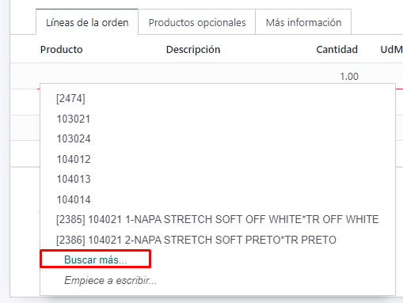
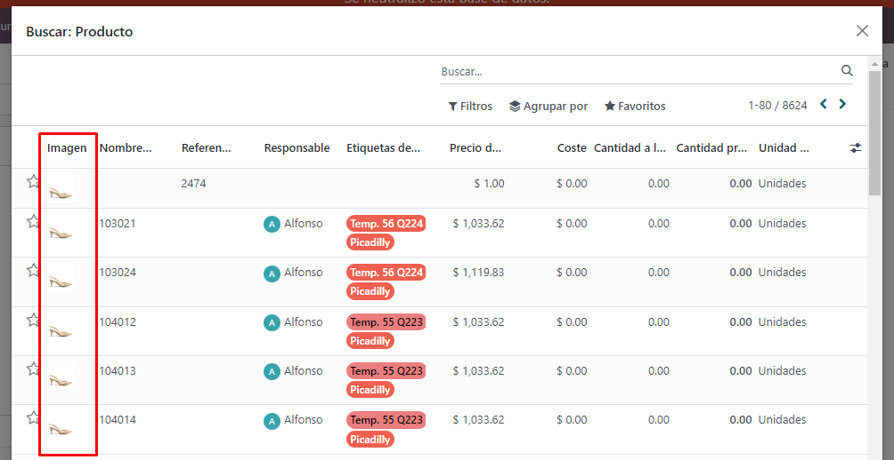
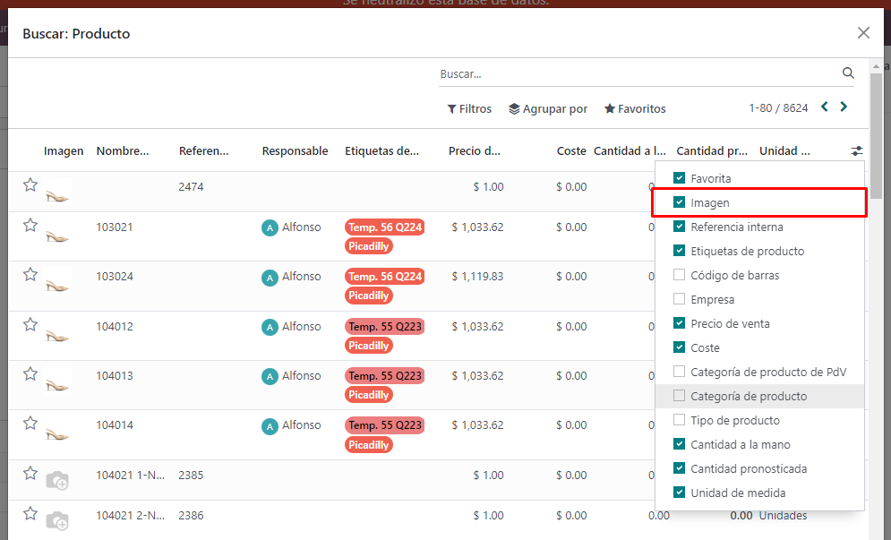

# [MADA] Search Extension Module by Alfonso (Ptree)

###### 08/05/2024 v16.1

- Cuando se añade una línea de producto, y se selecciona la opción de 'Buscar más'

- Se agrega la columna de Imagen, en caso de que el producto tenga imagen cargada sino aparecera un icono gris.

- La columna de imagen es opcional, se puede mostrar u ocultar a gusto

